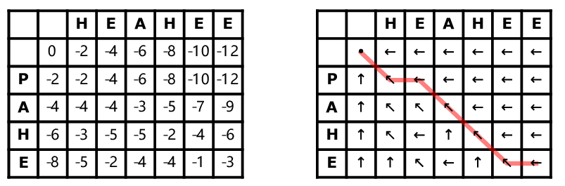

# Needleman-Algorithm

***************************************************************
The classical global pairwise alignment algorithm using dynamic programming is the Needleman–Wunsch algorithm.
• In this algorithm, an optimal alignment is obtained over the entire lengths of the two sequences.
• It must extend from the beginning to the end of both sequences to achieve the highest total score.
• In other words, the alignment path has to go from the bottom right corner of the matrix to the top left
corner.
• The drawback of focusing on getting a maximum score for the full-length sequence alignment is the risk
of missing the best local similarity.
• This strategy is only suitable for aligning two closely related sequences that are of the same length.
• For divergent sequences or sequences with different domain structures, the approach does not produce
optimal alignment.
• One of the few web servers dedicated to global pairwise alignment is EMBOSS.
**************************************************************

SCORING
match = +1
mismatch = -2
gap penalty = -2
